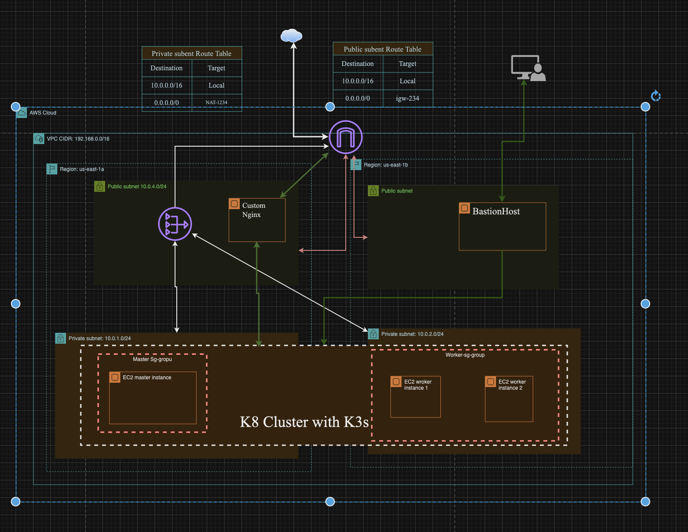

# HA Kubernetes Cluster with K3s 
 Visualization what we are going to build here. I used Custom  L7 Nginx for Loadbalancer without Ingress.



# Terraform Infrastructure Deployment Documentation

## VPC Module (`vpc.tf`)

The VPC module creates the Virtual Private Cloud (VPC) for your application. It utilizes the `terraform-aws-modules/vpc/aws` module.

### Parameters

- `name`: Concatenation of project name and VPC name.
- `cidr`: CIDR block for the VPC.
- `private_subnets`: CIDR blocks for private subnets.
- `public_subnets`: CIDR blocks for public subnets.
- `azs`: Availability Zones for the VPC.
- `enable_nat_gateway`: Enable NAT Gateway.
- `single_nat_gateway`: Use a single NAT Gateway.
- `enable_dns_hostnames`: Enable DNS hostnames.
- `one_nat_gateway_per_az`: Allow one NAT Gateway per AZ.
- `enable_dns_support`: Enable DNS support.

## Key Pair Module (`k8-nodes.tf`)

The Key Pair module creates an AWS Key Pair for SSH access.

### Parameters

- `key_name`: Name of the SSH key.
- `public_key`: Path to the public key file.

## Master Security Group Module (`k8-nodes.tf`)

The Master Security Group module creates a security group for the master instances.

### Ingress Rules

- SSH (port 22)
- Port 6443
- Ports 2379-2380
- Ports 10250-10260
- Port 6782

### Egress Rule

- Allow all outbound traffic.

## Worker Security Group Module (`k8-nodes.tf`)

The Worker Security Group module creates a security group for worker instances.

### Ingress Rules

- SSH (port 22)
- Port 10250
- Ports 30000-32767

### Egress Rule

- Allow all outbound traffic.

## EC2 Instances Module (`k8-nodes.tf`)

The EC2 Instances module launches master and worker instances.

### Master Instance

- AMI: Ubuntu 20.04 LTS
- Instance Type: t2.medium
- Security Group: master_sg
- Subnet: Private subnet
- Root Volume Size: 20 GB

### Worker Instances

- AMI: Ubuntu 20.04 LTS
- Instance Type: t2.medium
- Security Group: worker_sg
- Subnet: Private subnet
- Root Volume Size: 20 GB

## Bastion Host Module (`BastionHost.tf`)

The Bastion Host module creates a security group and an EC2 instance for the bastion host.

### Ingress Rule

- SSH (port 22)

### Egress Rule

- Allow all outbound traffic.

### Bastion Host Instance

- AMI: Ubuntu 20.04 LTS
- Instance Type: t2.micro
- Security Group: bastion
- Subnet: Public subnet
- Root Volume Size: 10 GB

## Load Balancer Module (`Loadbalancer.tf`)

The Load Balancer module creates a security group and an EC2 instance for the load balancer.

### Ingress Rule

- Port 80
- Port 22

### Egress Rule

- Allow all outbound traffic.

### Load Balancer Instance

- AMI: Ubuntu 20.04 LTS
- Instance Type: t2.small
- Security Group: load-balancer
- Subnet: Public subnet
- Root Volume Size: 15 GB

## Outputs

- `instance_private_ips`: Private IPs of master and worker instances.
- `bastionHost_public_ip`: Public IP of the bastion host.
- `lb_public_ip`: Public IP of the load balancer.

## Conclusion

This Terraform configuration deploys a scalable infrastructure for your application, including a VPC, EC2 instances, a bastion host, and a load balancer. Ensure proper security measures and adjust configurations according to your specific requirements.


# Ansible Script for K3s Kubernetes Cluster Deployment

This Ansible script automates the deployment of a K3s Kubernetes cluster on infrastructure created by Terraform. The script is divided into two main sections: one for deploying the K3s master node, and another for adding additional K3s agent nodes.

## Deploy K3s Cluster

### Prerequisites

- Ansible is installed on the machine running this playbook.
- Terraform has been used to provision the infrastructure.

### Project Variables (`project-vars`)


```yaml
master_ip: 10.0.1.170
remote_dest: /home/ubuntu/k3s_token
local_dest: /Users/mahmud/Desktop/skill-development/ha-kubernetes-with-k3s/ansible/temp/

target_directory: /home/ubuntu/.kube
target_file: config

local_dockerfile: /Users/mahmud/Desktop/skill-development/ha-kubernetes-with-k3s/ansible/Dockerfile
```

### Playbook (`deploy_k3s_cluster.yml`)

```yaml
---
- name: Deploy K3s Cluster
  hosts: k3s_nodes
  become: true
  vars_files:
    - project-vars
  tasks:
    - name: Install dependencies
      apt:
        name: "{{ item }}"
        state: present
      with_items:
        - curl
        - sudo
        - iptables

    - name: Download and install K3s
      shell: curl -sfL https://get.k3s.io | INSTALL_K3S_EXEC="--tls-san {{master_ip}}" sh -

    - name: Set permissions for k3s.yaml
      file:
        path: /etc/rancher/k3s/k3s.yaml
        mode: '0644'
      become: true

    - name: Set ownership for k3s.yaml
      become: true
      command: chown {{ lookup('pipe', 'id -u') }}:{{ lookup('pipe', 'id -g') }} /etc/rancher/k3s/k3s.yaml

    - name: Retrieve K3s token
      shell: sudo cat /var/lib/rancher/k3s/server/node-token
      register: k3s_token

    - name: Store K3s token in a file
      copy:
        content: "{{ k3s_token.stdout }}"
        dest: "{{remote_dest}}" 

    - name: Fetch the file from the remote host
      ansible.builtin.fetch:
        src: "{{remote_dest}}"  
        dest: "{{local_dest}}"       
        flat: yes

    - name: Fetch the kubeconfig file from the remote host
      ansible.builtin.fetch:
        src: "/etc/rancher/k3s/k3s.yaml"  
        dest: "{{local_dest}}"       
        flat: yes
```


# Ansible Playbook: Configure Load Balancer with Docker

This Ansible playbook automates the installation and configuration of a load balancer using Docker and Nginx on target hosts. The playbook is divided into two main sections: one for installing Docker and creating an Nginx image, and the other for creating and running an Nginx container from the created image.

## Install Docker and Configure Load Balancer

### Prerequisites

- Ansible is installed on the machine running this playbook.
- Target hosts are defined in the Ansible inventory (`nginx_lb` group).
- Variables are configured in the `project-vars` file.

### Playbook (`configure-loadbalancer.yaml`)

```yaml
---
- name: Install Docker
  hosts: nginx_lb
  become: yes
  vars_files:
    - project-vars
  tasks:
    - name: Update package index
      apt: update_cache=yes

    - name: Install packages to allow apt to use a repository over HTTPS
      apt: name={{ item }} state=present
      with_items:
      - apt-transport-https
      - ca-certificates
      - curl
      - software-properties-common

    - name: Add Docker's official GPG key
      apt_key: url=https://download.docker.com/linux/ubuntu/gpg state=present

    - name: Set up the stable repository
      apt_repository: repo='deb [arch=amd64] https://download.docker.com/linux/ubuntu {{ ansible_distribution_release }} stable' state=present

    - name: Install Docker CE
      apt: name=docker-ce state=present

    - name: Start Docker daemon
      systemd:
         name: docker
         state: started 

    - name: Add user to the docker group
      user: 
        name: ubuntu
        groups: docker 
        append: yes 

    - name: Reconnect to server session
      meta: reset_connection

- name: Create Nginx Image from Dockerfile
  hosts: nginx_lb
  become: yes
  vars_files:
    - project-vars
  tasks:
    - name: Check Dockerfile existence
      stat:
        path: /home/ubuntu/Dockerfile
      register: stat_result

    - name: Copy Dockerfile to server
      copy:
        src: "{{local_dockerfile}}"
        dest: "/home/ubuntu"
      when: not stat_result.stat.exists

    - name: Build Docker Nginx Image
      docker_image:
        name: nginx-loadbalancer
        build:
          path: /home/ubuntu/
          pull: "yes"
        source: build
        state: present

- name: Create Nginx Container from Image
  hosts: nginx_lb
  become: yes
  vars: 
    container_name: nginx-lb
  tasks:
    - name: Create Nginx Container
      docker_container:
        name: "{{ container_name }}"
        image: nginx-loadbalancer 
        ports:
          - "80:80"
        state: started
```